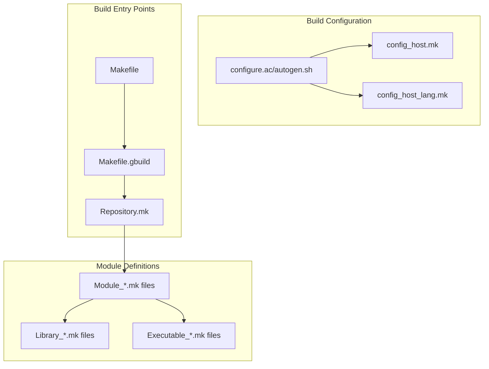
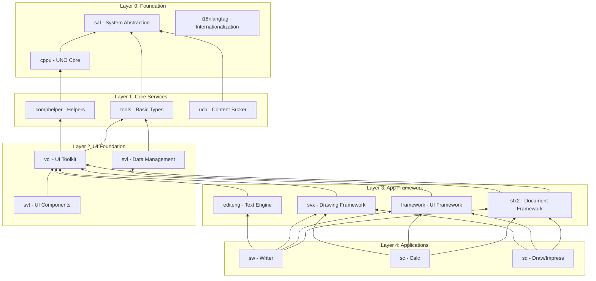

# LibreOffice Build System & Module Analysis

*Deep dive into the gbuild system and module organization*
*Date: 2025-07-23*

## Overview

LibreOffice uses gbuild, a sophisticated GNU make-based build system that manages ~200 modules with complex interdependencies. This analysis explores the build architecture, module organization, and dependency patterns.

## GBuild Architecture

### Core Build Components



### Build System Files Structure

**Top-Level Build Files:**
- `Makefile` - Main entry point, handles autogen and dispatch
- `Makefile.gbuild` - Core gbuild implementation
- `Repository.mk` - Repository-wide settings and module list
- `RepositoryModule_*.mk` - Platform-specific module lists

**Configuration System:**
- `configure.ac` - Autotools configuration script
- `autogen.sh` - Configuration wrapper script
- `config_host.mk.in` - Configuration template
- `distro-configs/` - Distribution-specific configurations

## Module Organization Patterns

### Module Types & Classifications

**Core Infrastructure Modules:**
```makefile
# System Foundation
Module_sal          # System Abstraction Layer
Module_tools        # Basic data types and utilities
Module_comphelper   # Component helper functions

# Platform Integration
Module_vcl          # Visual Class Library (UI toolkit)
Module_svl          # StarView Library (data management)
Module_svt          # StarView Tools (UI components)
```

**Application Framework:**
```makefile
# Document Framework
Module_sfx2         # StarOffice Framework
Module_framework    # Application framework
Module_unotools     # UNO utilities
Module_ucb          # Universal Content Broker

# Text Processing
Module_editeng      # Edit engine
Module_svx          # StarView Extensions (drawing framework)
```

**Application Modules:**
```makefile
# Office Applications
Module_sw           # Writer (word processor)
Module_sc           # Calc (spreadsheet)
Module_sd           # Draw/Impress (graphics/presentation)
Module_swui         # Writer UI components
Module_scui         # Calc UI components
```

### Module Dependency Analysis

**Dependency Layers (Bottom-Up):**



## Build Target Types

### Primary gbuild Classes

**Library Targets:**
```makefile
# Shared libraries - main application logic
$(eval $(call gb_Library_Library,sw))
$(eval $(call gb_Library_Library,vcl))
$(eval $(call gb_Library_Library,sfx))

# Static libraries - utility code
$(eval $(call gb_StaticLibrary_StaticLibrary,sal_textenc))
```

**Executable Targets:**
```makefile
# Main applications
$(eval $(call gb_Executable_Executable,soffice))
$(eval $(call gb_Executable_Executable,unopkg))

# Development tools
$(eval $(call gb_Executable_Executable,genconv_dict))
```

**Test Targets:**
```makefile
# Unit tests
$(eval $(call gb_CppunitTest_CppunitTest,sw_macros_test))
$(eval $(call gb_CppunitTest_CppunitTest,vcl_graphic_test))

# UI tests
$(eval $(call gb_UITest_UITest,writer_tests))
$(eval $(call gb_UITest_UITest,calc_tests))
```

### Specialized Target Types

**Resource Management:**
```makefile
# UI configurations (menus, toolbars, dialogs)
$(eval $(call gb_UIConfig_UIConfig,modules/swriter))

# Resource packages (icons, help files)
$(eval $(call gb_Package_Package,accessoriessymbolsthemes))

# Localization
$(eval $(call gb_AllLangPackage_AllLangPackage,autotextshare))
```

**External Dependencies:**
```makefile
# Third-party library integration
$(eval $(call gb_ExternalProject_ExternalProject,boost))
$(eval $(call gb_UnpackedTarball_UnpackedTarball,icu))
```

## Module Configuration Patterns

### Typical Module Structure

**Module_sw.mk Example:**
```makefile
$(eval $(call gb_Module_Module,sw))

$(eval $(call gb_Module_add_targets,sw,\
    Library_sw \
    Library_swui \
    Library_msword \
    Library_sw_writerfilter \
))

$(eval $(call gb_Module_add_l10n_targets,sw,\
    AllLangPackage_sw \
    UIConfig_swriter \
))

$(eval $(call gb_Module_add_check_targets,sw,\
    CppunitTest_sw_core_doc \
    CppunitTest_sw_core_text \
    CppunitTest_sw_macros_test \
))

$(eval $(call gb_Module_add_slowcheck_targets,sw,\
    CppunitTest_sw_filter_rtf \
    CppunitTest_sw_filter_ww8 \
))
```

### Conditional Compilation

**Feature-based Building:**
```makefile
# Optional features
ifneq ($(ENABLE_SCRIPTING),)
$(eval $(call gb_Module_add_targets,scripting,\
    Library_scriptframe \
    Library_protocolhandler \
))
endif

# Platform-specific targets
ifeq ($(OS),WNT)
$(eval $(call gb_Module_add_targets,shell,\
    Library_shlxthdl \
    Library_ooofilt \
))
endif
```

## Dependency Management

### Library Dependency Declaration

**Library_sw.mk Example:**
```makefile
$(eval $(call gb_Library_Library,sw))

$(eval $(call gb_Library_use_libraries,sw,\
    basegfx \
    comphelper \
    cppu \
    cppuhelper \
    editeng \
    i18nlangtag \
    i18nutil \
    msfilter \
    sal \
    sfx \
    sot \
    svl \
    svt \
    svx \
    svxcore \
    tk \
    tl \
    ucbhelper \
    utl \
    vcl \
    xmlreader \
))
```

### External Dependencies

**External Library Integration:**
```makefile
# Optional external libraries
$(eval $(call gb_Library_use_external,sw,boost_headers))
$(eval $(call gb_Library_use_external,sw,icu_headers))

# System libraries
ifeq ($(OS),LINUX)
$(eval $(call gb_Library_add_libs,sw,\
    -ldl \
    -lm \
    -lpthread \
))
endif
```

## Build Performance Optimization

### Parallel Build Support

**Module-Level Parallelism:**
- Each module can be built independently once dependencies are satisfied
- gbuild automatically resolves dependency order
- Make's `-j` flag enables parallel compilation within modules

**Target-Level Parallelism:**
- Multiple libraries within a module can build in parallel
- Test targets run independently
- Resource compilation parallelized

### Build Caching

**Precompiled Headers:**
```makefile
# PCH support for faster compilation
$(eval $(call gb_Library_use_pch,sw,sw/inc/pch/precompiled_sw))
```

**Incremental Builds:**
- Dependency tracking at file level
- Only changed source files recompiled
- Module boundaries minimize rebuild scope

## Platform Abstraction in Build

### Platform-Specific Configuration

**Platform Detection:**
```makefile
# OS detection
ifeq ($(OS),WNT)
    # Windows-specific settings
else ifeq ($(OS),MACOSX)
    # macOS-specific settings
else ifeq ($(OS),LINUX)
    # Linux-specific settings
endif
```

**Compiler Abstraction:**
```makefile
# Compiler-specific flags
include $(SRCDIR)/solenv/gbuild/platform/$(HOST_PLATFORM).mk
include $(SRCDIR)/solenv/gbuild/platform/com_$(COM).mk
```

## Development Workflow Integration

### Testing Integration

**Test Target Organization:**
- `unitcheck` - Fast unit tests run during development
- `slowcheck` - Comprehensive tests for CI
- `subsequentcheck` - Integration tests requiring full install
- `uicheck` - UI automation tests
- `perfcheck` - Performance regression tests

**Single Test Execution:**
```bash
# Run specific test
make CppunitTest_sw_macros_test CPPUNIT_TEST_NAME="testBasicMacro"

# Debug test execution
make CppunitTest_sw_macros_test CPPUNITTRACE="gdb --args"
```

### IDE Integration

**Generated Project Files:**
- gbuildtojson generates compile_commands.json for LSP
- Platform-specific IDE project generation
- Integration with VS Code, Xcode, Visual Studio

## Build System Evolution

### Historical Context
- Evolution from dmake (legacy build system)
- Migration to gbuild for better dependency management
- Ongoing modernization efforts

### Future Directions
- Potential migration to CMake or Bazel being evaluated
- Improved external dependency management
- Enhanced parallel build capabilities

## Conclusion

The gbuild system demonstrates sophisticated build engineering:
- **Modular architecture** enabling parallel development
- **Sophisticated dependency management** handling complex relationships
- **Cross-platform abstraction** supporting diverse environments
- **Comprehensive testing integration** ensuring code quality
- **Performance optimization** for efficient builds

This build system architecture provides the foundation for scaling LibreOffice development across a large, distributed team while maintaining build reliability and performance.
