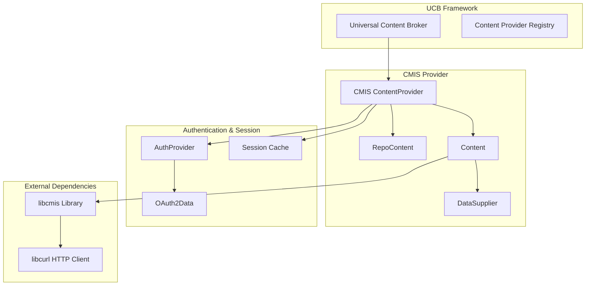

# CMIS Implementation Analysis in LibreOffice

*Deep dive into the existing CMIS (Content Management Interoperability Services) architecture and Google Drive integration*
*Date: 2025-07-23*

## Executive Summary

LibreOffice's CMIS implementation provides a robust foundation for cloud storage integration, already supporting Google Drive, OneDrive, and Alfresco Cloud through the Universal Content Broker (UCB) architecture. The existing implementation uses the `libcmis` library with OAuth2 authentication and includes sophisticated session management, error handling, and cross-platform support.

## CMIS Architecture Overview

### Core Components



## File Structure & Key Components

### Primary Source Location: `ucb/source/ucp/cmis/`

**Core Implementation Files:**
- `cmis_provider.hxx/cxx` - Main UCB content provider
- `cmis_content.hxx/cxx` - Document/folder content handling
- `cmis_repo_content.hxx/cxx` - Repository content management
- `cmis_datasupplier.cxx` - Data enumeration for folder listings
- `auth_provider.hxx/cxx` - OAuth2 authentication handler
- `cmis_url.hxx/cxx` - URL parsing and construction
- `cmis_resultset.cxx` - Search result handling
- `cmis_strings.hxx` - String constants and error messages

**Supporting Files:**
- `ucpcmis1.component` - UNO component registration
- `std_inputstream.cxx/hxx` - Stream adapters
- `std_outputstream.cxx/hxx` - Output stream handling

### Configuration Files

**OAuth2 Configuration:** `config_host/config_oauth2.h.in`
```cpp
// Google Drive settings
#define GDRIVE_BASE_URL "https://www.googleapis.com/drive/v3"
#define GDRIVE_CLIENT_ID ""
#define GDRIVE_CLIENT_SECRET ""
#define GDRIVE_AUTH_URL "https://accounts.google.com/o/oauth2/v2/auth"
#define GDRIVE_TOKEN_URL "https://oauth2.googleapis.com/token"
#define GDRIVE_REDIRECT_URI "urn:ietf:wg:oauth:2.0:oob"
#define GDRIVE_SCOPE "https://www.googleapis.com/auth/drive.file"
```

**Build Configuration:** `configure.ac`
- `--with-gdrive-client-id` and `--with-gdrive-client-secret` options
- Runtime OAuth credential injection

**Server Registry:** `officecfg/registry/data/org/openoffice/Office/Common.xcu`
- Pre-configured CMIS server URLs and display names
- Google Drive listed as first option

## ContentProvider Architecture

### UCB Integration Pattern

The CMIS provider follows the standard UCB pattern:

```cpp
class ContentProvider : public ::ucbhelper::ContentProviderImplHelper {
private:
    // Session cache: (BindingURL, Username) -> libcmis::Session*
    std::map<std::pair<OUString, OUString>, libcmis::Session*> m_aSessionCache;

public:
    // Main entry point for content creation
    virtual css::uno::Reference<css::ucb::XContent> SAL_CALL
    queryContent(const css::uno::Reference<css::ucb::XContentIdentifier>& Identifier) override;

    // Session management
    libcmis::Session* getSession(const OUString& sBindingUrl, const OUString& sUsername);
    void registerSession(const OUString& sBindingUrl, const OUString& sUsername,
                        libcmis::Session* pSession);
};
```

### URL Scheme & Parsing

**CMIS URL Format:**
```
vnd.libreoffice.cmis://[username@]encoded_binding_url[/path][#object_id]
```

**Google Drive Example:**
```
vnd.libreoffice.cmis://user@https%3A//www.googleapis.com/drive/v3%23repository_id/My%20Document.odt
```

**URL Components:**
- **Binding URL**: Base API endpoint (encoded in host part)
- **Repository ID**: Cloud service identifier (in URL fragment)
- **Object Path**: File/folder path within repository
- **Object ID**: Unique object identifier (for Google Drive, file ID)

### Content Types

The implementation supports two main content types:

```cpp
// Repository content (top-level, shows repositories)
inline constexpr OUString CMIS_REPO_TYPE = u"application/vnd.libreoffice.cmis-repository"_ustr;

// File content
inline constexpr OUString CMIS_FILE_TYPE = u"application/vnd.libreoffice.cmis-file"_ustr;

// Folder content
inline constexpr OUString CMIS_FOLDER_TYPE = u"application/vnd.libreoffice.cmis-folder"_ustr;
```

## Google Drive OAuth2 Implementation

### Authentication Flow

**Current Google Drive Authentication Process:**

1. **Initial Connection Attempt**
   ```cpp
   // Skip traditional username/password for OAuth providers
   if (m_aURL.getBindingUrl() == GDRIVE_BASE_URL) {
       bSkipInitialPWAuth = true;
       rPassword = aAuthProvider.getRefreshToken(rUsername);
   }
   ```

2. **OAuth2 Data Setup**
   ```cpp
   if (m_aURL.getBindingUrl() == GDRIVE_BASE_URL) {
       libcmis::SessionFactory::setOAuth2AuthCodeProvider(AuthProvider::copyWebAuthCodeFallback);
       oauth2Data = boost::make_shared<libcmis::OAuth2Data>(
           GDRIVE_AUTH_URL, GDRIVE_TOKEN_URL,
           GDRIVE_SCOPE, GDRIVE_REDIRECT_URI,
           GDRIVE_CLIENT_ID, GDRIVE_CLIENT_SECRET);
   }
   ```

3. **Authorization Code Flow (Fallback)**
   - Opens browser to Google's OAuth consent screen
   - User copies authorization code from browser
   - Code entered into LibreOffice dialog
   - Code exchanged for access/refresh tokens

4. **Token Storage**
   ```cpp
   // Store refresh token securely in platform keychain
   aAuthProvider.storeRefreshToken(rUsername, rPassword,
                                   m_pSession->getRefreshToken());
   ```

### Session Management

**Session Caching Strategy:**
```cpp
// Session key: binding URL + username
OUString sSessionId = m_aURL.getBindingUrl() + m_aURL.getRepositoryId();
m_pSession = m_pProvider->getSession(sSessionId, m_aURL.getUsername());

if (nullptr == m_pSession) {
    // Create new session with libcmis
    m_pSession = libcmis::SessionFactory::createSession(
        OUSTR_TO_STDSTR(m_aURL.getBindingUrl()),
        rUsername, rPassword,
        OUSTR_TO_STDSTR(m_aURL.getRepositoryId()),
        false, std::move(oauth2Data));

    // Cache the session
    m_pProvider->registerSession(sSessionId, m_aURL.getUsername(), m_pSession);
}
```

## File Operations Implementation

### CRUD Operations

**Read (Download):**
```cpp
bool Content::feedSink(const uno::Reference<uno::XInterface>& xSink,
                      const uno::Reference<ucb::XCommandEnvironment>& xEnv) {
    libcmis::Document* document = dynamic_cast<libcmis::Document*>(getObject(xEnv).get());
    uno::Reference<io::XInputStream> xIn = new StdInputStream(document->getContentStream());
    // Stream to sink (file dialog, document view, etc.)
}
```

**Create/Update (Upload):**
```cpp
void Content::insert(const uno::Reference<io::XInputStream>& xInputStream,
                    bool bReplaceExisting, std::u16string_view rMimeType,
                    const uno::Reference<ucb::XCommandEnvironment>& xEnv) {
    // Handle chunked upload for large files
    // Set content stream and properties
    // Commit to CMIS repository
}
```

**Delete:**
```cpp
// Implemented through CMIS command execution
// Supports both files and folders
```

**List (Enumerate):**
```cpp
class DataSupplier {
    void getData() {
        std::vector<uno::Reference<ucb::XContent>> aChildren =
            m_pChildrenProvider->getChildren();
        // Filter by file type (folders, documents, all)
        // Populate result set
    }
};
```

## Extension Points for Enhanced Google Drive Support

### 1. OAuth2 Token Management

**Current Implementation:**
- Uses `libcmis::OAuth2Data` for configuration
- Platform-specific secure storage via `task::PasswordContainer`
- Manual authorization code entry (not ideal UX)

**Extension Opportunities:**
```cpp
// Enhanced token service
class GoogleDriveTokenProvider {
    // Automatic browser OAuth flow
    // Background token refresh
    // Multi-account support
    // Centralized token management for all cloud providers
};
```

### 2. Direct REST API Integration

**Current Path:** LibreOffice → libcmis → CMIS REST → Google Drive API
**Enhanced Path:** LibreOffice → Direct Google Drive REST API

**Benefits:**
- Access to full Google Drive API features
- Better error handling and status reporting
- Real-time collaboration metadata
- Advanced search and filtering
- Shared drive support

### 3. Performance Enhancements

**Current Bottlenecks:**
- CMIS abstraction layer overhead
- Synchronous file operations
- Limited parallel transfer support

**Extension Points:**
```cpp
// Background transfer queue
class DriveTransferManager {
    void queueUpload(const OUString& localFile, const OUString& driveLocation);
    void queueDownload(const OUString& driveFile, const OUString& localLocation);
    // Progress reporting, pause/resume, bandwidth throttling
};
```

### 4. UI Integration Enhancements

**Current UI:**
- Generic CMIS server selection
- Basic file picker integration
- Limited status feedback

**Extension Opportunities:**
- Native Google Drive branding and icons
- Drive-specific file picker pane
- Real-time sync status indicators
- Shared/collaboration indicators
- Quick access to recent Drive files

## Technical Recommendations for Extension

### 1. Preserve UCB Architecture

**Benefits of UCB:**
- Unified file access across all LibreOffice components
- Consistent error handling and progress reporting
- Integration with existing file dialog and document framework
- Cross-platform abstraction

**Approach:**
```cpp
// Extend existing CMIS provider rather than replace
class EnhancedCmisProvider : public cmis::ContentProvider {
    // Add Google Drive-specific optimizations
    // Maintain backward compatibility
    // Preserve existing session management
};
```

### 2. OAuth2 Service Extension

**Create Reusable OAuth Service:**
```cpp
// New UNO service for OAuth2 management
interface XOAuth2TokenProvider {
    string requestToken(string provider, string scope);
    void refreshToken(string provider, string refreshToken);
    boolean isTokenValid(string provider);
};
```

### 3. Progressive Enhancement Strategy

**Phase 1: Optimize Existing CMIS**
- Improve OAuth2 flow UX
- Add better error handling
- Enhance session management

**Phase 2: REST API Integration**
- Direct Google Drive API calls for critical operations
- Maintain CMIS fallback compatibility
- Add Drive-specific features

**Phase 3: Advanced Features**
- Real-time collaboration indicators
- Advanced search and filtering
- Shared drive support
- Background sync

## Security Considerations

### Token Security
- **Current:** Platform keychain integration via `task::PasswordContainer`
- **Enhancement:** Add token encryption and expiration monitoring

### API Security
- **Current:** HTTPS with certificate validation
- **Enhancement:** Add API key rotation and audit logging

### Data Privacy
- **Current:** No local caching of sensitive data
- **Enhancement:** Add configurable data retention policies

## Testing & Quality Assurance

### Current Test Coverage
- Unit tests in `ucb/source/ucp/cmis/qa/`
- Integration tests for basic CRUD operations
- Cross-platform compatibility testing

### Extension Test Requirements
- OAuth2 flow testing across platforms
- Large file upload/download stress testing
- Network error resilience testing
- Token refresh and expiration handling
- Multiple account scenarios

## Conclusion

The existing CMIS implementation provides a solid, well-architected foundation for Google Drive integration. The UCB framework, OAuth2 authentication, and session management are production-ready and well-tested.

**Key Strengths:**
- **Robust Architecture:** UCB provides consistent file access patterns
- **Security:** OAuth2 with secure token storage
- **Cross-Platform:** Works on Windows, macOS, Linux
- **Standards-Based:** CMIS compliance ensures interoperability

**Extension Strategy:**
1. **Enhance existing CMIS provider** with Google Drive optimizations
2. **Preserve UCB architecture** for consistency with LibreOffice ecosystem
3. **Add REST API layer** for Google Drive-specific features
4. **Implement progressive enhancement** to maintain stability

This approach allows us to deliver improved Google Drive functionality while maintaining the stability and consistency that LibreOffice users expect.
