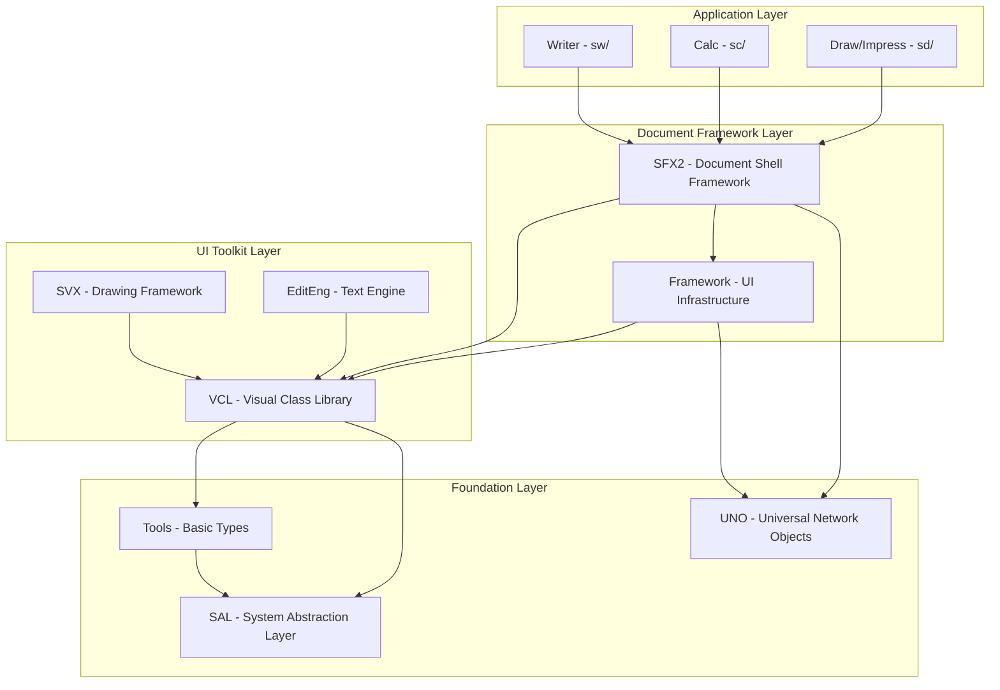

# LibreOffice Core Architecture Analysis

*Analysis of the LibreOffice Core codebase architecture, module hierarchy, and relationships*
*Date: 2025-07-23*

## Executive Summary

LibreOffice Core (~10M lines of C++) follows a sophisticated layered architecture with clear separation between platform abstraction, UI framework, document management, and application logic. The codebase demonstrates exceptional engineering with cross-platform support, UNO component architecture, and a modular build system that scales to hundreds of components.

## Architectural Overview

### Core Architectural Layers



## Module Hierarchy & Dependencies

### Foundation Layer (Level 0)

**SAL (System Abstraction Layer)**
- **Purpose**: Platform abstraction for OS services
- **Location**: `sal/`
- **Dependencies**: None (foundation layer)
- **Key Services**: Memory management, threading, file I/O, platform detection
- **Usage**: Universally used by all other modules

**UNO (Universal Network Objects)**
- **Purpose**: Component architecture and inter-process communication
- **Location**: `cppu/, cppuhelper/, offapi/`
- **Dependencies**: SAL
- **Key Services**: Interface definition, component lifecycle, reflection
- **Usage**: Enables loose coupling between components

### Core Services Layer (Level 1)

**Tools (TL Library)**
- **Purpose**: Basic data structures and utilities
- **Location**: `tools/`
- **Dependencies**: SAL, UNO, basic helper libraries
- **Key Services**: `Rectangle`, `Color`, `Point`, containers, string utilities
- **Usage**: Used by virtually all higher-level modules

**Comphelper**
- **Purpose**: Helper functions for component development
- **Dependencies**: SAL, UNO
- **Usage**: Utility functions for UNO component development

### UI Foundation Layer (Level 2)

**VCL (Visual Class Library)**
- **Purpose**: Cross-platform UI toolkit and graphics abstraction
- **Location**: `vcl/`
- **Dependencies**: SAL, Tools, UNO
- **Architecture**:
  - Platform-independent API (`include/vcl/`)
  - Platform-specific backends (`vcl/win/`, `vcl/unx/gtk3/`, `vcl/osx/`)
  - SalInstance factory pattern for platform abstraction

**Key VCL Components:**
```cpp
// Core VCL class hierarchy
class OutputDevice    // Base rendering interface
class Window : public OutputDevice    // Base windowing class
class Control : public Window    // Base widget class
class Dialog : public SystemWindow    // Dialog management
```

**Cross-Platform Backend Strategy:**
- **Windows**: Win32 API integration
- **macOS**: Cocoa/AppKit integration
- **Linux**: GTK3/GTK4, Qt5/Qt6, KDE Frameworks
- **Mobile**: Android NDK, iOS
- **Headless**: Bitmap-based rendering for servers

### Document Framework Layer (Level 3)

**SFX2 (StarOffice Framework)**
- **Purpose**: Document shell architecture and lifecycle management
- **Location**: `sfx2/`
- **Dependencies**: VCL, Tools, UNO, Framework
- **Key Classes**:
  - `SfxObjectShell` - Document model container
  - `SfxViewShell` - View controller base class
  - `SfxViewFrame` - View frame management
  - `SfxFrame` - Window/frame hierarchy

**Framework**
- **Purpose**: Application UI infrastructure (menus, toolbars, docking)
- **Location**: `framework/`
- **Dependencies**: VCL, UNO, SFX2
- **Key Services**: Menu management, toolbar construction, accelerator handling

**Document Architecture Pattern:**
```cpp
// Document-View-Controller pattern in LibreOffice
SfxObjectShell (Model)
    ↓
SfxViewShell (View Controller)
    ↓
SfxViewFrame (View Container)
    ↓
SfxFrame (Window Management)
```

### Application Layer (Level 4)

**Writer (SW)**
- **Purpose**: Word processor application
- **Location**: `sw/`
- **Core Classes**: `SwDoc` (document model), `SwDocShell`, `SwView`
- **Key Features**: Text layout engine, tables, frames, fields, mail merge

**Calc (SC)**
- **Purpose**: Spreadsheet application
- **Location**: `sc/`
- **Core Classes**: `ScDocument`, `ScDocShell`, `ScTabView`
- **Key Features**: Formula engine, pivot tables, charts, cell formatting

**Draw/Impress (SD)**
- **Purpose**: Drawing and presentation applications
- **Location**: `sd/`
- **Core Classes**: `SdDrawDocument`, `DrawDocShell`, `DrawViewShell`
- **Key Features**: Vector graphics, slide management, animation

## Critical Architectural Patterns

### 1. Document Shell Pattern
All LibreOffice applications follow the document shell pattern:
- **SfxObjectShell**: Contains document data and business logic
- **SfxViewShell**: Handles user interaction and presentation
- **SfxViewFrame**: Manages UI chrome (menus, toolbars, status)
- **Multiple Views**: Single document can have multiple view shells

### 2. UNO Component Architecture
- **Interface-based design**: All components expose UNO interfaces
- **Loose coupling**: Components communicate through well-defined interfaces
- **Language binding**: Enables scripting in Python, Basic, JavaScript
- **Remote procedure calls**: Supports distributed computing scenarios

### 3. Platform Abstraction (SAL Pattern)
VCL uses the SalInstance factory pattern:
```cpp
// Platform abstraction through virtual interfaces
class SalInstance {
    virtual SalFrame* CreateFrame() = 0;
    virtual SalVirtualDevice* CreateVirtualDevice() = 0;
    virtual SalTimer* CreateSalTimer() = 0;
    // Platform-specific implementation in subclasses
};
```

### 4. Build System Architecture (GBuild)
- **Modular structure**: Each component has `Module_*.mk` file
- **Dependency management**: Automatic resolution of inter-module dependencies
- **Parallel builds**: Supports efficient parallel compilation
- **External dependencies**: Clean integration of third-party libraries

## Key Technical Insights

### Threading Model
- **Solar Mutex**: Global recursive mutex protecting most LibreOffice code
- **Single-threaded UI**: Main thread runs in Single-threaded Apartment (STA)
- **Worker threads**: Background threads use Multi-threaded Apartment (MTA)
- **UNO threading**: UNO methods can be called from multiple threads

### Memory Management
- **VclPtr system**: Smart pointers for VCL objects with lifecycle management
- **Reference counting**: UNO objects use reference counting
- **RAII patterns**: Extensive use of Resource Acquisition Is Initialization

### Rendering Architecture
- **GDIMetafile**: Vector graphics intermediate format
- **Drawing Layer**: Modern rendering pipeline using primitives
- **Output devices**: Abstraction for screen, printer, PDF output
- **Multi-backend**: Same code renders to screen, print, PDF, bitmap

## Integration Points for New Features

Based on analysis of cursor_docs blueprints, key integration points:

### 1. Document-Level Tabs
- **Entry Point**: `framework/source/fwe/frame/Frame.cxx`
- **UI Integration**: New VCL TabBar widget in `vcl/source/control/`
- **Cross-platform**: Platform-specific tab implementations (GtkNotebook, NSTabView, Win32)

### 2. Cloud Storage Integration
- **Entry Point**: UCB (Universal Content Broker) providers in `ucb/source/ucp/`
- **OAuth Integration**: New authentication service in Token Manager
- **REST APIs**: libcurl-based HTTP clients for Drive/Dropbox

### 3. Session Management
- **Entry Point**: `desktop/source/app/app.cxx` for application lifecycle
- **Persistence**: JSON-based session storage
- **UI Component**: Quick switcher in `framework/source/uielement/`

## Development Recommendations

1. **Follow Layer Dependencies**: Never violate the dependency hierarchy
2. **Use UNO Interfaces**: Prefer UNO interfaces for component communication
3. **Platform Abstraction**: Use VCL abstractions rather than platform-specific code
4. **Solar Mutex Discipline**: Acquire Solar Mutex only when necessary
5. **Build System**: Use gbuild classes for new components
6. **Testing**: Provide CppUnit tests for all new functionality

## Conclusion

LibreOffice Core demonstrates exceptional software architecture with:
- **Clear separation of concerns** through layered design
- **Sophisticated platform abstraction** enabling true cross-platform support
- **Scalable component architecture** through UNO
- **Robust document framework** supporting multiple applications
- **Modern build system** handling massive codebase efficiently

The architecture provides solid foundation for enterprise modernization while maintaining stability and platform compatibility.
