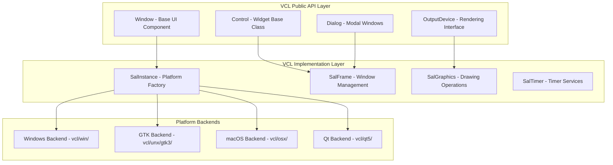
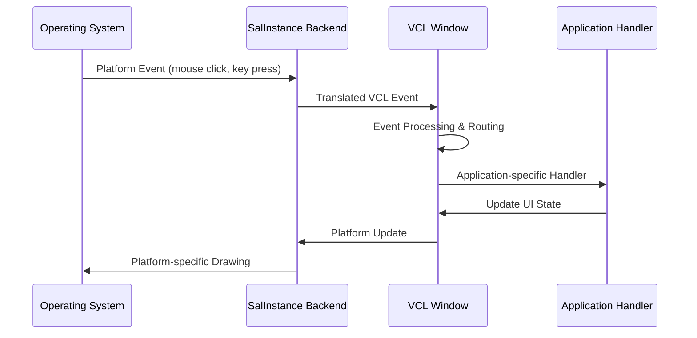

# VCL UI Framework Architecture Analysis

*Deep dive into LibreOffice's Visual Class Library and cross-platform UI abstraction*
*Date: 2025-07-23*

## Overview

The Visual Class Library (VCL) is LibreOffice's cross-platform UI toolkit, providing widget abstractions, event handling, and rendering services. This analysis explores VCL's architecture, platform backends, and implications for implementing document-level tabs.

## VCL Architecture Overview

### Core VCL Components



## Platform Abstraction Strategy

### SalInstance Factory Pattern

VCL uses the Strategy pattern through SalInstance to abstract platform differences:

```cpp
// vcl/inc/salinst.hxx - Platform abstraction interface
class SalInstance {
public:
    virtual SalFrame*           CreateFrame(SalFrame* pParent,
                                          SalFrameStyleFlags nStyle) = 0;
    virtual SalObject*          CreateObject(SalFrame* pParent) = 0;
    virtual SalVirtualDevice*   CreateVirtualDevice(SalGraphics* pGraphics) = 0;
    virtual SalTimer*           CreateSalTimer() = 0;
    virtual SalSystem*          CreateSalSystem() = 0;
    virtual SalBitmap*          CreateSalBitmap() = 0;

    // Platform-specific implementations override these methods
    virtual void                RunEventLoop() = 0;
    virtual bool                ProcessEvents(bool bAllEvents = false) = 0;
};
```

### Platform-Specific Implementations

**Windows Backend (vcl/win/):**
```cpp
// Win32 implementation using Windows API
class WinSalInstance : public SalInstance {
    virtual SalFrame* CreateFrame(SalFrame* pParent, SalFrameStyleFlags nStyle) override {
        return new WinSalFrame();  // HWND-based implementation
    }
    virtual void RunEventLoop() override {
        // Windows message pump using GetMessage/DispatchMessage
    }
};
```

**GTK Backend (vcl/unx/gtk3/):**
```cpp
// GTK3 implementation
class GtkSalInstance : public SalInstance {
    virtual SalFrame* CreateFrame(SalFrame* pParent, SalFrameStyleFlags nStyle) override {
        return new GtkSalFrame();  // GtkWindow-based implementation
    }
    virtual void RunEventLoop() override {
        // GTK event loop using gtk_main_iteration
    }
};
```

**macOS Backend (vcl/osx/):**
```cpp
// Cocoa implementation
class AquaSalInstance : public SalInstance {
    virtual SalFrame* CreateFrame(SalFrame* pParent, SalFrameStyleFlags nStyle) override {
        return new AquaSalFrame();  // NSWindow-based implementation
    }
    virtual void RunEventLoop() override {
        // Cocoa event loop using NSApplication
    }
};
```

## Widget Hierarchy & Class Structure

### Core VCL Class Hierarchy

```cpp
// include/vcl/outdev.hxx - Base rendering interface
class OutputDevice {
    // Core drawing operations
    virtual void DrawLine(const Point& rStartPt, const Point& rEndPt);
    virtual void DrawRect(const tools::Rectangle& rRect);
    virtual void DrawText(const Point& rStartPt, const OUString& rStr);
};

// include/vcl/window.hxx - Base windowing class
class Window : public OutputDevice {
    // Window management
    virtual void Show(bool bVisible = true);
    virtual void SetPosSizePixel(const Point& rNewPos, const Size& rNewSize);
    virtual void Invalidate(const tools::Rectangle& rRect = tools::Rectangle());

    // Event handling
    virtual void MouseButtonDown(const MouseEvent& rMEvt);
    virtual void MouseButtonUp(const MouseEvent& rMEvt);
    virtual void KeyInput(const KeyEvent& rKEvt);
    virtual void Paint(vcl::RenderContext& rRenderContext, const tools::Rectangle& rRect);
};

// include/vcl/ctrl.hxx - Base control class
class Control : public Window {
    // Control-specific functionality
    virtual void GetFocus();
    virtual void LoseFocus();
    virtual void StateChanged(StateChangedType nType);
};
```

### VCL Smart Pointer System

VCL uses a sophisticated smart pointer system for memory management:

```cpp
// include/vcl/vclptr.hxx - VCL smart pointer
template<class T> class VclPtr {
    T* m_pInstance;
public:
    VclPtr() : m_pInstance(nullptr) {}
    VclPtr(T* pInstance) : m_pInstance(pInstance) { if (m_pInstance) m_pInstance->acquire(); }
    ~VclPtr() { if (m_pInstance) m_pInstance->release(); }

    T* operator->() const { return m_pInstance; }
    T& operator*() const { return *m_pInstance; }
};

// Usage pattern for VCL objects
VclPtr<PushButton> pButton = VclPtr<PushButton>::Create(pParent, WB_DEFBUTTON);
pButton->SetText("Click Me");
pButton->Show();
```

## Event Handling Architecture

### Event Flow Pattern



### Event Types & Handling

**Mouse Events:**
```cpp
class MouseEvent {
    Point       maPos;          // Mouse position
    sal_uInt16  mnClicks;       // Click count
    sal_uInt16  mnCode;         // Button/modifier state

    bool IsLeft() const;
    bool IsRight() const;
    bool IsShift() const;
    bool IsCtrl() const;
};

// Window mouse event handlers
virtual void Window::MouseButtonDown(const MouseEvent& rMEvt) {
    // Handle mouse button press
    if (rMEvt.IsLeft()) {
        // Left button logic
    }
}
```

**Keyboard Events:**
```cpp
class KeyEvent {
    vcl::KeyCode maKeyCode;     // Key + modifiers
    sal_Unicode  mnCharCode;    // Character code

    bool IsShift() const;
    bool IsCtrl() const;
    bool IsAlt() const;
};

// Window keyboard event handlers
virtual void Window::KeyInput(const KeyEvent& rKEvt) {
    vcl::KeyCode aKeyCode = rKEvt.GetKeyCode();
    if (aKeyCode.GetCode() == KEY_TAB && aKeyCode.IsCtrl()) {
        // Handle Ctrl+Tab
    }
}
```

## Rendering & Graphics Architecture

### OutputDevice Rendering Pipeline

```cpp
// Core rendering interface
class OutputDevice {
    // Drawing state
    std::unique_ptr<vcl::Font>  mpFont;
    Color                       maFillColor;
    Color                       maLineColor;

    // Core drawing operations
    void SetFont(const vcl::Font& rFont);
    void SetTextColor(const Color& rColor);
    void DrawText(const Point& rPt, const OUString& rStr);
    void DrawLine(const Point& rStartPt, const Point& rEndPt);
    void DrawRect(const tools::Rectangle& rRect);
    void DrawPolygon(const tools::Polygon& rPoly);
};
```

### Cross-Platform Font Handling

**Font Abstraction:**
```cpp
// Font management across platforms
class vcl::Font {
    OUString    maFamilyName;    // Font family
    FontWeight  meWeight;        // Bold, normal, etc.
    FontItalic  meItalic;        // Italic style
    Size        maSize;          // Font size

    // Platform-specific font matching in backends
};
```

## TabBar Widget Implementation Analysis

Based on cursor_docs requirements for document-level tabs, here's the architectural approach:

### TabBar Widget Architecture

```cpp
// Proposed vcl/source/control/tabbar.cxx
class TabBar : public Control {
private:
    struct TabInfo {
        OUString    msText;         // Tab label
        bool        mbModified;     // Dirty state (*)
        bool        mbActive;       // Currently selected
        sal_uInt16  mnTabId;        // Unique identifier
        tools::Rectangle maRect;    // Tab bounds
    };

    std::vector<TabInfo>    maTabs;
    sal_uInt16              mnActiveTab;
    sal_uInt16              mnNextTabId;

public:
    // Tab management
    sal_uInt16  InsertTab(const OUString& rText);
    void        RemoveTab(sal_uInt16 nTabId);
    void        SetTabText(sal_uInt16 nTabId, const OUString& rText);
    void        SetTabModified(sal_uInt16 nTabId, bool bModified);
    void        SelectTab(sal_uInt16 nTabId);

    // Event handling
    virtual void MouseButtonDown(const MouseEvent& rMEvt) override;
    virtual void Paint(vcl::RenderContext& rRenderContext, const tools::Rectangle& rRect) override;
    virtual void KeyInput(const KeyEvent& rKEvt) override;

    // UNO event emission
    void FireTabSelected(sal_uInt16 nTabId);
    void FireTabClosed(sal_uInt16 nTabId);
};
```

### Platform-Specific Tab Implementation

**GTK Backend (vcl/unx/gtk3/):**
```cpp
class GtkSalTabBar {
    GtkWidget*     mpNotebook;    // GtkNotebook widget

    void InitNative() {
        mpNotebook = gtk_notebook_new();
        gtk_notebook_set_scrollable(GTK_NOTEBOOK(mpNotebook), TRUE);
        gtk_notebook_set_show_border(GTK_NOTEBOOK(mpNotebook), FALSE);
    }

    void AddTab(const OUString& rText) {
        GtkWidget* pLabel = gtk_label_new(rText.toUtf8().getStr());
        GtkWidget* pContent = gtk_box_new(GTK_ORIENTATION_VERTICAL, 0);
        gtk_notebook_append_page(GTK_NOTEBOOK(mpNotebook), pContent, pLabel);
    }
};
```

**Windows Backend (vcl/win/):**
```cpp
class WinSalTabBar {
    HWND    mhTabCtrl;    // Win32 Tab Control

    void InitNative() {
        mhTabCtrl = CreateWindow(WC_TABCONTROL, L"",
            WS_CHILD | WS_VISIBLE | TCS_TABS,
            0, 0, 0, 0, mhWndParent, nullptr, GetModuleHandle(nullptr), nullptr);
    }

    void AddTab(const OUString& rText) {
        TCITEM tci = {};
        tci.mask = TCIF_TEXT;
        tci.pszText = const_cast<LPWSTR>(rText.getStr());
        TabCtrl_InsertItem(mhTabCtrl, TabCtrl_GetItemCount(mhTabCtrl), &tci);
    }
};
```

**macOS Backend (vcl/osx/):**
```cpp
class AquaSalTabBar {
    NSTabView*  mpTabView;    // NSTabView widget

    void InitNative() {
        mpTabView = [[NSTabView alloc] init];
        [mpTabView setTabViewType:NSTopTabsBezelBorder];
        [mpTabView setControlSize:NSRegularControlSize];
    }

    void AddTab(const OUString& rText) {
        NSTabViewItem* pItem = [[NSTabViewItem alloc] init];
        [pItem setLabel:CreateNSString(rText)];
        [mpTabView addTabViewItem:pItem];
    }
};
```

## Integration with Document Framework

### SfxViewFrame Integration

For document-level tabs, integration with the SFX2 framework is required:

```cpp
// Modified sfx2/source/view/viewfrm.cxx
class SfxViewFrame {
private:
    VclPtr<TabBar>  mpTabBar;         // Document tab bar
    std::vector<SfxViewShell*> maViewShells;  // Multiple view shells

public:
    // Tab management for documents
    void CreateTabBar();
    void AddDocumentTab(SfxViewShell* pViewShell, const OUString& rTitle);
    void RemoveDocumentTab(SfxViewShell* pViewShell);
    void SwitchToTab(sal_uInt16 nTabId);

private:
    DECL_LINK(TabSelectHdl, TabBar*, void);
    DECL_LINK(TabCloseHdl, TabBar*, void);
};
```

### UNO Integration

TabBar needs UNO interface exposure for scripting and automation:

```cpp
// New UNO interface in offapi/
interface XDocumentTabBar : XInterface {
    [attribute] short ActiveTab;
    [attribute, readonly] short TabCount;

    short insertTab([in] string TabText);
    void removeTab([in] short TabId);
    void selectTab([in] short TabId);

    void addTabSelectionListener([in] XTabSelectionListener Listener);
    void removeTabSelectionListener([in] XTabSelectionListener Listener);
};
```

## Memory Management & Lifecycle

### VCL Object Lifecycle

VCL objects follow specific lifecycle patterns:

```cpp
// VCL object creation pattern
VclPtr<Window> CreateTabBar(vcl::Window* pParent) {
    VclPtr<TabBar> pTabBar = VclPtr<TabBar>::Create(pParent, WB_STDTABCONTROL);
    pTabBar->Show();
    return pTabBar;
}

// Proper cleanup
void DestroyTabBar(VclPtr<TabBar>& rpTabBar) {
    if (rpTabBar) {
        rpTabBar->Hide();
        rpTabBar.disposeAndClear();  // Proper VCL disposal
    }
}
```

### Resource Management

VCL provides automatic resource cleanup through RAII patterns:

```cpp
class TabBar : public Control {
    // Automatic cleanup in destructor
    virtual ~TabBar() override {
        // Clear tab data
        maTabs.clear();
        // Base class handles window cleanup
    }

    // Proper dispose pattern
    virtual void dispose() override {
        // Custom cleanup before base disposal
        ClearAllTabs();
        Control::dispose();
    }
};
```

## Performance Considerations

### Rendering Optimization

**Efficient Repainting:**
```cpp
void TabBar::Paint(vcl::RenderContext& rRenderContext, const tools::Rectangle& rRect) {
    // Only repaint affected tabs
    for (auto& rTab : maTabs) {
        if (rTab.maRect.IsOver(rRect)) {
            DrawTab(rRenderContext, rTab);
        }
    }
}
```

**Event Optimization:**
```cpp
void TabBar::MouseButtonDown(const MouseEvent& rMEvt) {
    // Efficient hit testing
    sal_uInt16 nTabId = HitTest(rMEvt.GetPosPixel());
    if (nTabId != TABBAR_TAB_NOTFOUND && nTabId != mnActiveTab) {
        SelectTab(nTabId);  // Only switch if different tab
    }
}
```

## Accessibility Integration

VCL provides accessibility support through platform-specific interfaces:

```cpp
class TabBar : public Control {
    // Accessibility support
    virtual css::uno::Reference<css::accessibility::XAccessible> CreateAccessible() override;

private:
    void NotifyAccessibilityEvent(AccessibilityEventType nType);
};
```

## Conclusion

The VCL architecture provides:

- **Robust platform abstraction** through SalInstance factory pattern
- **Comprehensive widget toolkit** with proper lifecycle management
- **Efficient event handling** with platform-native performance
- **Flexible rendering pipeline** supporting diverse output devices
- **Strong memory management** through VclPtr smart pointers

For implementing document-level tabs:
1. **Create TabBar widget** following VCL patterns
2. **Implement platform backends** using native tab controls
3. **Integrate with SfxViewFrame** for document management
4. **Provide UNO interfaces** for scripting support
5. **Ensure accessibility compliance** through VCL accessibility framework

This architecture provides the solid foundation needed for enterprise-grade UI features while maintaining LibreOffice's cross-platform compatibility and performance standards.
